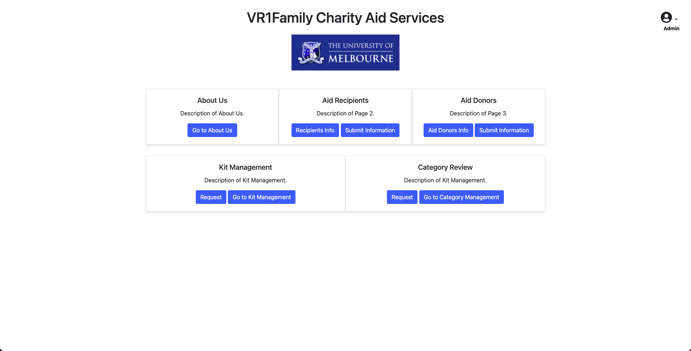

# VR1Family Charity Aid Services Web Application

This repository is our final project for the course [SWEN90016 Software Processes and Management](https://handbook.unimelb.edu.au/2023/subjects/swen90016) @ The University of Melbourne.

## Tech


## Demo

<!-- add screenshot -->
<!--  -->

### Watch our demo


https://github.com/XiaoLinZzz/VR1Family-Charity-Aid-Services/assets/65701285/4d969b2a-65c9-4914-ba5f-a9a87ca0d3ab


### Try our demo

Our application is deployed on Heroku. You can try it out [here](https://spmproject.herokuapp.com/). 

(Due to there is a charge for using Heroku, our demo will expire in June 2023.)


## Features
- Manage aid items, including name, category, quantity, and details
- Manage aid kits, which are collections of aid items
- Manage recipient information, including general and private data
- View and manage aid categories and their respective quantities and statuses
- Basic user interface for easy navigation and data management


## Installation
1. Make sure you have [Node.js](https://nodejs.org/en) and [MongoDB](https://www.mongodb.com/) installed on your machine.

2. Clone the repository:
```
git clone https://github.com/XiaoLinZzz/VR1Family-Charity-Aid-Services.git
```

3. Navigate to the project directory and install dependencies:
```
cd VR1Family-Charity-Aid-Services
npm install
```

4. Create a .env file in the root folder of the project and add the following environment variables:
```
PORT=3001
URL=http://localhost
MONGO_URI=<your_mongodb_connection_string>
```
Replace `<your_mongodb_connection_string>` with the connection string for your MongoDB database.

5. Start the server:
```
npm start
```
The server should now be running on `http://localhost:3001`.


## Contributing
1. Fork the project repository and create a new branch for your feature or bugfix.

2. Make your changes and commit them to your branch.

3. Push your branch to your forked repository on GitHub.

4. Create a pull request to merge your changes into the main repository.

5. Once your pull request is reviewed and approved, it will be merged into the main repository.

Please follow the code style and conventions already present in the project.


## License
This project is licensed under the MIT License. See the [LICENSE](LICENSE) file for details.
